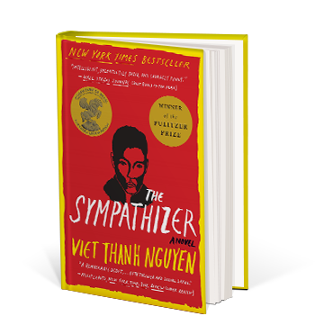
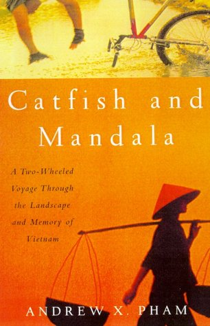
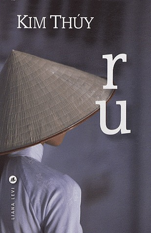
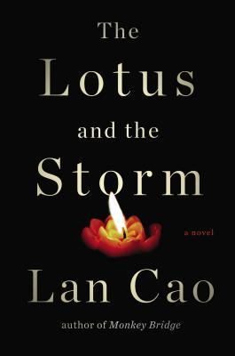

## Background 
I was born and raised in Saigon, Vietnam. Torn between the past and present, I enjoy learning about and reading fictions on the post-war Vietnamese diaspora, as well as Vietnamese refugees/immigrants experience. Here are a couple books on this topic that I like. 

 - [The Sympathizer](https://www.amazon.com/Sympathizer-Novel-Pulitzer-Prize-Fiction-ebook/dp/B00PSSG4MM/ref=sr_1_1?crid=3AWHZS7FANIC1&keywords=the+sympathizer&qid=1572631822&sprefix=the+sympa%2Caps%2C181&sr=8-1) by *Viet Thanh Nguyen* 

 
 - [Catfish and Mandala](https://www.amazon.com/Catfish-Mandala-Two-Wheeled-Through-Landscape/dp/0312267177/ref=sr_1_1?crid=O3RYMH1WMNGI&keywords=catfish+and+mandala&qid=1572631757&sprefix=catfish+and+man%2Caps%2C128&sr=8-1) by *Andrew X. Pham*
 
 
 
 - [Ru](https://www.amazon.com/Ru-Novel-Kim-Th%C3%BAy/dp/1608198987/ref=sr_1_1?keywords=ru+kim+thuy&qid=1572631868&sr=8-1) by *Kim Thuy*

 
 - [Lotus and the Storm](https://www.amazon.com/Lotus-Storm-Novel-Lan-Cao/dp/0143127616/ref=sr_1_1?keywords=lotus+and+the+storm&qid=1572631853&sr=8-1) by *Lan Cao*

